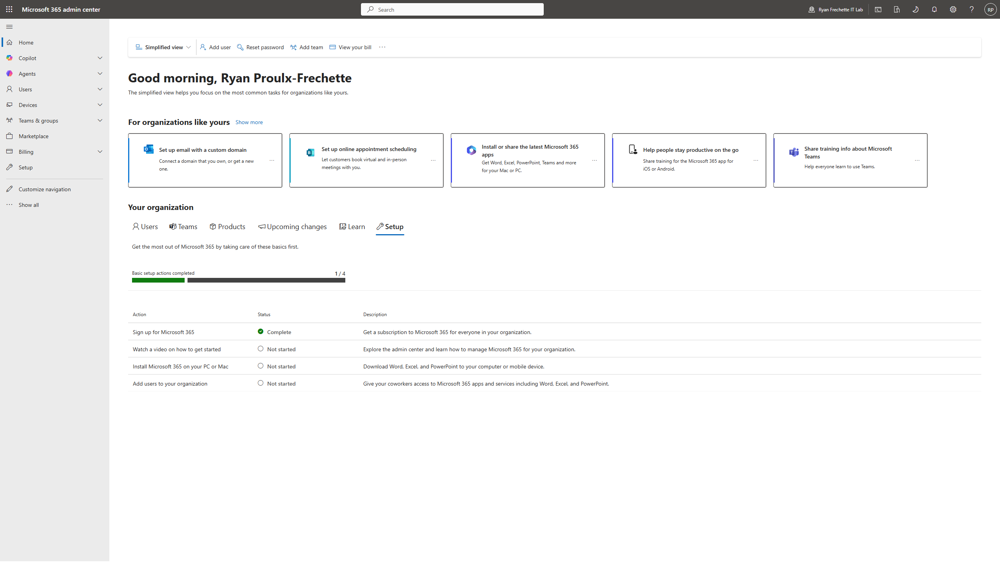
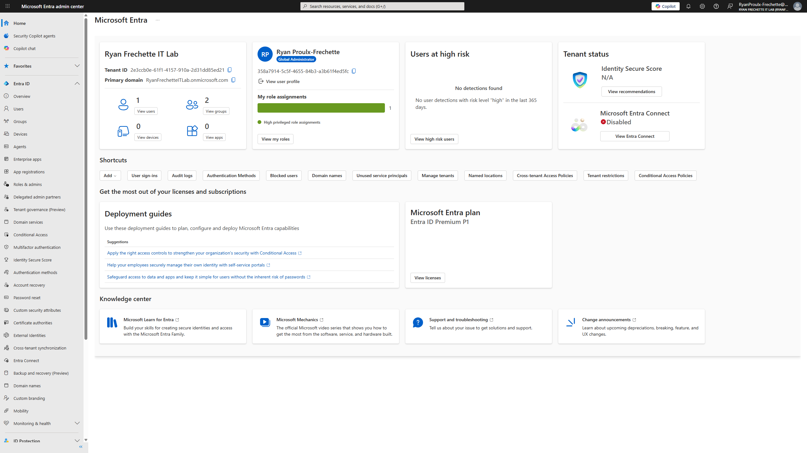
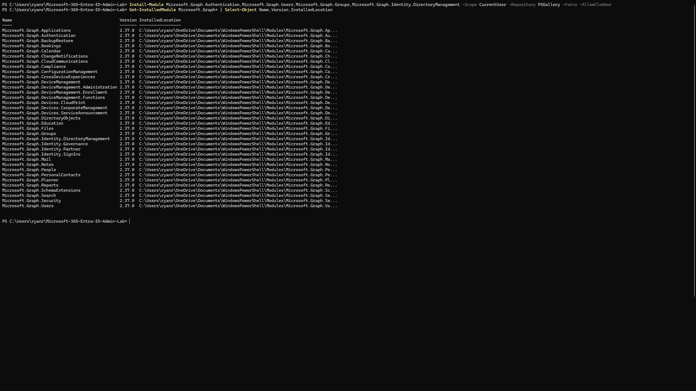
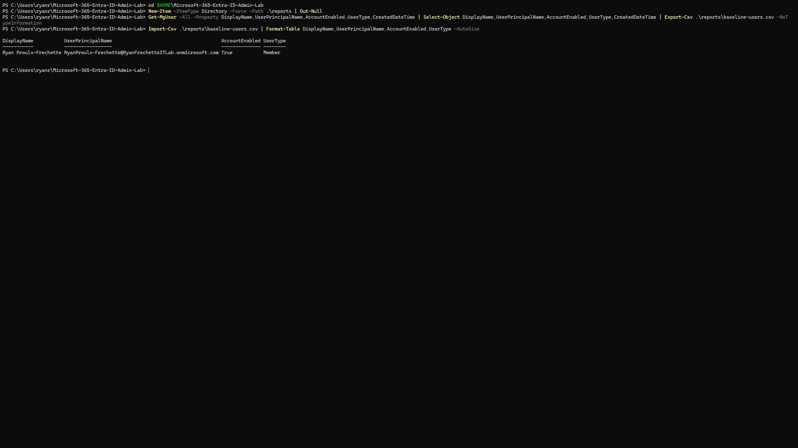

# Microsoft 365 / Entra ID Admin Lab

## Recruiter TL;DR

This portfolio lab demonstrates Microsoft 365 and Entra ID administration skills for help desk, IT support, cloud support, and junior Microsoft 365 admin roles. It shows hands-on practice with a live Microsoft 365 Business Premium tenant, including admin center access, user management, group and access workflows, license support, MFA/security concepts, PowerShell automation, and ticket-style documentation.

> Full case study: [case-study.md](case-study.md) | Resume bullets: [resume-bullets.md](resume-bullets.md)

---

## Business Scenario

A small business needs an IT support admin to manage Microsoft 365 users, groups, licenses, sign-in issues, MFA/security settings, and basic cloud identity workflows.

This lab simulates that environment:

- Microsoft 365 Business Premium trial tenant
- Microsoft 365 admin center
- Microsoft Entra admin center
- Test users and groups
- PowerShell / Microsoft Graph administration
- Ticket-style support documentation
- Screenshot-based proof for each major workflow

| Area | What this lab demonstrates |
|---|---|
| Microsoft 365 Admin | Admin center access, users, licenses, apps, and tenant management |
| Entra ID | Cloud identity, users, groups, authentication, and security settings |
| Help Desk Support | Password reset, sign-in troubleshooting, MFA review, and access requests |
| PowerShell | Microsoft Graph setup, reports, and repeatable admin commands |
| Documentation | Screenshot walkthroughs, support tickets, case study, and resume bullets |

---

## Tools Used

| Tool | Purpose |
|---|---|
| Microsoft 365 Admin Center | User, license, billing, and service administration |
| Microsoft Entra Admin Center | Identity, groups, authentication, and access management |
| Microsoft Graph PowerShell | Admin automation and reporting |
| ShareX | Screenshot capture |
| PowerShell | Local automation, Git workflow, and Graph commands |
| Git / GitHub | Portfolio documentation and version control |

---

## Screenshot Walkthrough

### 1. Microsoft 365 Admin Center Access

<p>

</p>

**What was completed:**  
Confirmed access to the Microsoft 365 admin center using the lab admin account for the Business Premium trial tenant.

**What this proves:**  
The tenant is active, the admin account works, and the project is ready for Microsoft 365 user, group, license, security, and PowerShell administration workflows.

### 2. Microsoft Entra Admin Center Access

<p>

</p>

**What was completed:**  
Confirmed access to the Microsoft Entra admin center using the lab admin account for the Business Premium tenant.

**What this proves:**  
The tenant is visible in Entra, the admin account has Global Administrator access, and the lab is ready for identity, users, groups, authentication, security, and access-management workflows.

### 3. Microsoft Graph PowerShell Module Installed

<p>

</p>

**What was completed:**  
Installed Microsoft Graph PowerShell modules and confirmed installed module versions from PowerShell.

**What this proves:**  
The local admin workstation is ready to connect to Microsoft Graph for Microsoft 365 and Entra ID automation, reporting, and repeatable support workflows.

### 4. Microsoft Graph Tenant Context Confirmed

<p>

</p>

**What was completed:**  
Connected to Microsoft Graph with the lab admin account and confirmed the active tenant context with `Get-MgContext` and organization name with `Get-MgOrganization`.

**What this proves:**  
PowerShell is authenticated to the correct Microsoft 365 tenant and ready to run user, group, license, directory, and reporting commands against the lab environment.

### 5. Baseline User Report Exported

<p>

</p>

**What was completed:**  
Exported the current Microsoft 365 user list to `reports/baseline-users.csv` with Microsoft Graph PowerShell and displayed the report in the terminal.

**What this proves:**  
PowerShell can query tenant user data, export a reusable report, and create documentation artifacts that support real help desk and cloud admin workflows.

---

## Planned Build Steps

1. Confirm Microsoft 365 admin center access
2. Confirm Entra admin center access
3. Install and connect Microsoft Graph PowerShell
4. Create test users
5. Create groups and assign membership
6. Practice password reset and sign-in support workflows
7. Review MFA/security settings available in the tenant
8. Export reports with PowerShell
9. Document support tickets
10. Polish README, case study, and resume bullets

---

## Support Tasks Planned

These map directly to common help desk and cloud support tickets:

- New user onboarding
- Password reset and sign-in troubleshooting
- Group/access request
- License and app access support
- MFA/security review
- User offboarding

---

## Ticket Evidence

Full ticket documentation will live in [tickets/](tickets/).

| Ticket | Issue | File |
|---|---|---|
| 01 | New user onboarding | [tickets/01-new-user-onboarding.md](tickets/01-new-user-onboarding.md) |
| 02 | Password reset and sign-in support | [tickets/02-password-reset-and-sign-in.md](tickets/02-password-reset-and-sign-in.md) |
| 03 | Group access request | [tickets/03-group-access-request.md](tickets/03-group-access-request.md) |
| 04 | License and app access | [tickets/04-license-and-app-access.md](tickets/04-license-and-app-access.md) |
| 05 | MFA/security review | [tickets/05-mfa-security-review.md](tickets/05-mfa-security-review.md) |
| 06 | User offboarding | [tickets/06-user-offboarding.md](tickets/06-user-offboarding.md) |

---

## Screenshot Workflow

Screenshots are captured with ShareX and saved using the `labshot` PowerShell helper.

Example:

```powershell
labshot setup 02-entra-admin-center-home "docs: add Entra admin center screenshot"
```

Each screenshot should be:

- Captured
- Saved into the correct `screenshots/` folder
- Committed
- Pushed
- Displayed in this README
- Verified on GitHub

---

## Resume Value

This project is designed to support resume bullets around:

- Microsoft 365 administration
- Entra ID user and group management
- Password reset and sign-in support
- MFA/security concepts
- Microsoft Graph PowerShell
- Cloud support documentation
- Help desk ticket workflows

---

## Project Documents

| Document | Description |
|---|---|
| [case-study.md](case-study.md) | Hiring-manager case study |
| [resume-bullets.md](resume-bullets.md) | Resume bullets and LinkedIn/GitHub summaries |
| [screenshot-checklist.md](screenshot-checklist.md) | Screenshot capture plan |
| [tickets/](tickets/) | Ticket-style support documentation |
| [scripts/](scripts/) | PowerShell helpers and lab scripts |
| [reports/](reports/) | Exported CSV reports |

---

## Status

**In progress.** Microsoft 365 admin center access, Entra admin center access, Microsoft Graph module installation, Graph tenant context, and baseline user reporting are documented. Next step is beginning user lifecycle management.
